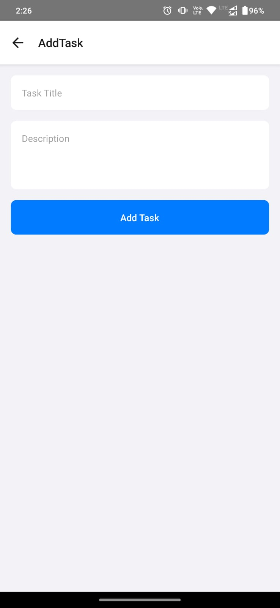
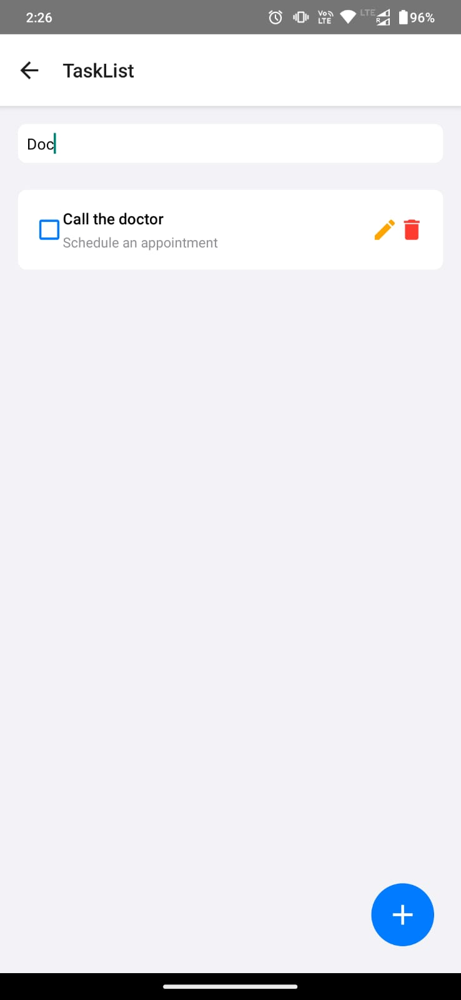
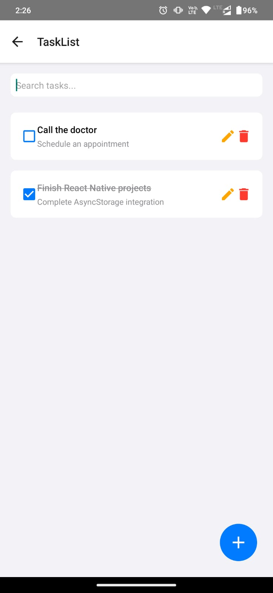

# Task Management App

## Overview
Task Management App is a React Native application designed to help users efficiently manage their tasks. The app supports adding, listing, and organizing tasks, ensuring a smooth task management experience.

## Features
- Add new tasks with details
- View a list of tasks
- Cross-platform support (Android & iOS)
- Uses TypeScript for type safety
- Follows modern React Native best practices

## Tech Stack
- **React Native**: Framework for building mobile applications
- **TypeScript**: Statically typed JavaScript
- **Redux (if used)**: For state management
- **React Navigation**: For handling app navigation
- **Jest**: For testing

## Installation

### Prerequisites
Ensure you have the following installed:
- Node.js
- npm or yarn
- React Native CLI
- Android Studio (for Android development)
- Xcode (for iOS development)

### Steps
1. Clone the repository:
   ```sh
   git clone https://github.com/yourusername/akshay0497-taskmanagementapp.git
   cd akshay0497-taskmanagementapp
   ```
2. Install dependencies:
   ```sh
   npm install
   # or
   yarn install
   ```
3. Start Metro bundler:
   ```sh
   npm start
   ```

## Running the App

### Android
Ensure an Android emulator is running or connect a physical device, then run:
```sh
npx react-native run-android
```

### iOS
Ensure Xcode is set up correctly, then run:
```sh
npx react-native run-ios
```

### Screenshots






## Project Structure
```
akshay0497-taskmanagementapp/
├── src/
│   ├── screens/              # App screens (AddTask, TaskList)
│   └── types/                # TypeScript type definitions
├── android/                  # Android-specific files
├── ios/                      # iOS-specific files
├── __tests__/                # Unit tests
├── App.tsx                   # Entry point of the app
├── package.json              # Project dependencies
└── README.md                 # Project documentation
```

## Contributing
Contributions are welcome! To contribute:
1. Fork the repository
2. Create a new branch (`feature-branch`)
3. Commit your changes
4. Push the branch and open a pull request

## License
This project is licensed under the MIT License.

## Contact
For any inquiries or support, please reach out to Akshay Kumar Gupta at 1997akshay04@gmail.com.
